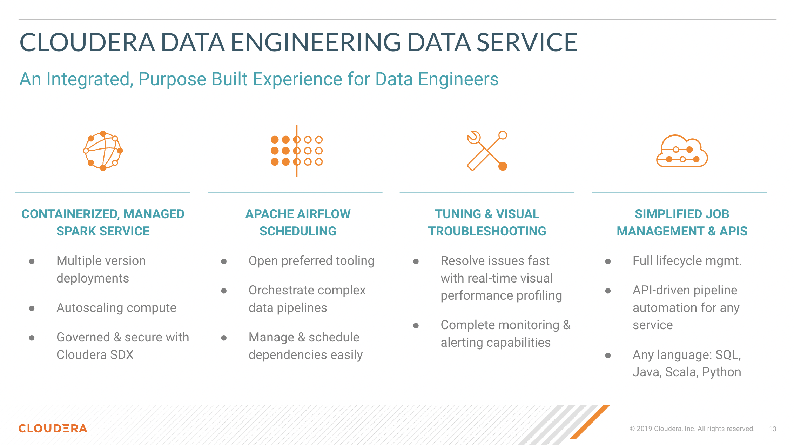
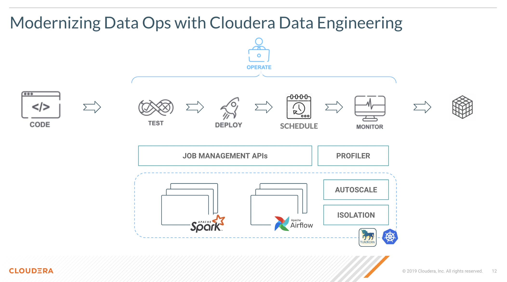

# First Step with Cloudera Data Engineering

## Summary

 The [Cloudera Data Engineering](https://docs.cloudera.com/data-engineering/cloud/index.html) Service is a containerized managed service for Spark and Airflow available in CDP Public and Private Cloud. CDE dramatically reduces complexity and cost of running Spark pipelines in Production and at Scale. It is designed for enterprise use cases within large organizations that comprise different stakeholders, Spark developers and DevOps teams.   

* CDE allows you to isolate your use cases within different Virtual Clusters. Virtual Clusters are easy to deploy and manage.
* CDE is available on Azure, AWS, Red Hat OCP or Cloudera ECS. Moreover, CDE allows you to adopt a Multi Cloud and Hybrid Cloud strategy by deploying multiple Virtual Clusters at the same time in any of these Clouds from a single unified Control Plane interface i.e. the CDP Management Console.
* CDE is integrated with SDX featuring built in lineage, security, and governance. All Spark jobs, users and datasets are automatically audited, tracked and secured via the same Control Plane interface.

From a functional perspective:

* You can choose between different Spark versions, share and reuse job dependencies across Spark pipelines, and monitor/observe Spark pipelines with rich native UIs, Logging and Troubleshooting feature.  
* You can create, submit and schedule Spark pipelines via the CDE CLI and API.
* You can isolate noisy neighbors with containerized jobs and autoscale infrastructure resources without Cloud, Docker or Kubernetes expertise.
* Optionally, you can leverage CDE's native Airflow service to orchestrate CDE Spark Jobs.
* As an alternative to Airflow, you can use the CDE API to integrate your CDE Spark pipelines with 3rd party tools such as GitLab, Github Actions, Jenkins and more.

## Tutorial Overview

In this tutorial we will create a basic batch CDE pipeline using the Lending Club Kaggle Competition dataset. The project includes three sections:

1. Creating and scheduling a simple Spark Job in the Cloudera Data Engineering Experience.
2. Creating and scheduling an Airflow Job in CDE.
3. Creating and scheduling Spark Jobs with the CDE CLI.

## Step by Step Instructions

Detailed instructions in English are provided in the [step_by_step_guides](https://github.com/pdefusco/CDE_First_Step/tree/main/step_by_step_guides) folder.

## Next Steps

If you are exploring CDE you may find the following tutorials relevant:

* [Spark 3 & Iceberg](https://github.com/pdefusco/Spark3_Iceberg_CML): A quick intro of Time Travel Capabilities with Spark 3.

* [Simple Intro to the CDE CLI](https://github.com/pdefusco/CDE_CLI_Simple): An introduction to the CDE CLI for the CDE beginner.

* [CDE CLI Demo](https://github.com/pdefusco/CDE_CLI_demo): A more advanced CDE CLI reference with additional details for the CDE user who wants to move beyond the basics.

* [CDE Resource 2 ADLS](https://github.com/pdefusco/CDEResource2ADLS): An example integration between ADLS and CDE Resource. This pattern is applicable to AWS S3 as well and can be used to pass execution scripts, dependencies, and virtually any file from CDE to 3rd party systems and viceversa.

* [Using CDE Airflow](https://github.com/pdefusco/Using_CDE_Airflow): A guide to Airflow in CDE including examples to integrate with 3rd party systems via Airflow Operators such as BashOperator, HttpOperator, PythonOperator, and more.

* [GitLab2CDE](https://github.com/pdefusco/Gitlab2CDE): a CI/CD pipeline to orchestrate Cross-Cluster Workflows for Hybrid/Multicloud Data Engineering.

* [CML2CDE](https://github.com/pdefusco/cml2cde_api_example): an API to create and orchestrate CDE Jobs from any Python based environment including CML. Relevant for ML Ops or any Python Users who want to leverage the power of Spark in CDE via Python requests.

* [Postman2CDE](https://github.com/pdefusco/Postman2CDE): An example of the Postman API to bootstrap CDE Services with the CDE API.

* [Oozie2CDEAirflow API](https://github.com/pdefusco/Oozie2CDE_Migration): An API to programmatically convert Oozie workflows and dependencies into CDE Airflow and CDE Jobs. This API is designed to easily migrate from Oozie to CDE Airflow and not just Open Source Airflow.

For more information on the Cloudera Data Platform and its form factors please visit [this site](https://docs.cloudera.com/).

For more information on migrating Spark jobs to CDE, please reference [this guide](https://docs.cloudera.com/cdp-private-cloud-upgrade/latest/cdppvc-data-migration-spark/topics/cdp-migration-spark-cdp-cde.html).

If you have any questions about CML or would like to see a demo, please reach out to your Cloudera Account Team or send a message [through this portal](https://www.cloudera.com/contact-sales.html) and we will be in contact with you soon.
