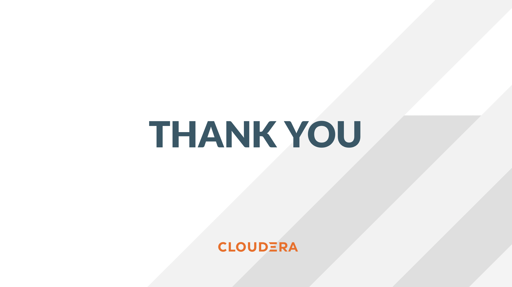

# Step by Step Guide - ENG

## Objective

This guide provides step by step instructions for the CDE tutorial "First Steps with Cloudera Data Engineering".


## Project Overview

The project includes three sections:

1. Creating and scheduling a simple Spark Job in the Cloudera Data Engineering Experience ([CDE](https://docs.cloudera.com/data-engineering/cloud/index.html)).
2. Creating and executing an Airflow Job in CDE.
3. Creating and scheduling Spark Jobs via the CDE CLI.


## Requirements

To reproduce the tutorial you will need:

* A CDE Virtual Cluster in Azure, AWS, OCP or Cloudera ECS.
* Your Public or Private Cloud Storage location (e.g. "s3a://bucket" in AWS).
* Your CDP Workload User and Password.
* This guide assumes that your user has already been granted permission to the CDP Environment. If not, please check with your CDP Admin to ensure you have been given the proper CDE User Roles and ID Broker Mappings.
* Basic familiarity with Python and PySpark.
* No code changes required. The data is included in the data folder and needs to be manually placed in cloud storage or HDFS.


#### Project Setup

Clone this github repository locally in your "Documents" folder. Open a terminal window in your local computer and execute the following commands.

```
cd ~/Documents
mkdir cde_first_steps
git clone https://github.com/pdefusco/CDE_First_Steps.git
```

Next, open the "cde_examples.ini" file located in the "cde_manual_jobs" folder and edit lines 1-3 with your credentials. While you can set your own prefix at line 2, you may have to obtain your Cloud Storage location and Region from your CDP Admin if you don't know them.

Finally, download the "LoanStats_2015_subset_112822.csv" file to your local computer and upload it to your Cloud Storage location.

### Section 1 - Creating and Executing a Simple Spark Job

Log into the CDE experience and create a new resource from the "Resources" tab. Please pick a unique name. A resource allows you to upload files and dependencies for reuse. This makes managing spark-submits easier.

Upload the files located in the "manual_jobs" directory of this project in your CDE resource. Notice that this includes files prefixed from 01 to 04, as well as the .ini credentials file.

CDE Jobs can be of type Spark or Airflow. Next, we will create three CDE Spark Jobs with the following settings.

For each of these, go to the "Jobs" tab and select "Create Job". Choose type "Spark" and pick the corresponding files from the CDE Resource you created.

It is important that you create the CDE Jobs with the exact names as shown below. When setting CDE Job configurations, do not schedule the jobs to execute on a recurrent basis.

```
Data Exploration Job:
  * Name: "01_Data_Exploration"
  * Application File: "01_Data_Exploration.py"
  * Python Version: "Python 3"

KPI Reporting Job:
  * Name: "02_KPI_Reporting:
  * Application File: "02_KPI_Reporting.py"
  * Python Version: "Python 3"

Model Scoring Job:
  * Name: "03_Ml_Scoring"
  * Application File: "03_Ml_Scoring.py"
  * Python Version: "Python 3"
```

You can now manually launch each of the above. Make sure to run them in order.


### Section 2 - Creating and Executing an Airflow Job

##### Airflow Concepts

In Airflow, a DAG (Directed Acyclic Graph) is defined in a Python script that represents the DAGs structure (tasks and their dependencies) as code.

For example, for a simple DAG consisting of three tasks: A, B, and C. The DAG can specify that A has to run successfully before B can run, but C can run anytime. Also that task A times out after 5 minutes, and B can be restarted up to 5 times in case it fails. The DAG might also specify that the workflow runs every night at 10pm, but should not start until a certain date.

For more information about Airflow DAGs, see Apache Airflow documentation [here](https://airflow.apache.org/docs/apache-airflow/stable/concepts/dags.html). For an example DAG in CDE, see CDE Airflow DAG documentation [here](https://docs.cloudera.com/data-engineering/cloud/orchestrate-workflows/topics/cde-airflow-editor.html).

The Airflow UI makes it easy to monitor and troubleshoot your data pipelines. For a complete overview of the Airflow UI, see  Apache Airflow UI documentation [here](https://airflow.apache.org/docs/apache-airflow/stable/ui.html).

##### Examining the Airflow DAG

Open the "04_Airflow_DAG.py" file and familiarize yourself with the code.

* The CDEJobRunOperator is imported at line 6. This operator allows you to execute the Spark Jobs you created earlier.
* Each code block at lines 29, 36 and 42 instantiates the CDEJobRunOperator class. This represents the actions executed by each task, in this case all three CDE Spark Jobs.
* At lines 33, 39 and 45 the job_name parameter is set to the CDE Spark Job name used in Section 1.
* Finally, task dependencies are specified at line 51.

CDE does not limit you to using the CDEJobRunOperator. First of all, Cloudera supports the CDWOperator to orchestrate SQL queries in CDW. Additionally, other operators including Python, HTTP, and Bash are available. If you want to learn more about Airflow in CDE, please reference [Using CDE Airflow](https://github.com/pdefusco/Using_CDE_Airflow).

##### Creating the CDE Airflow Job

In order to create an Airflow job, go to the "Jobs" page and create one with type "Airflow". Name the job as you'd like and select the "04_Airflow_DAG.py" file from your CDE Resource. When complete, create and execute the job.

To validate that the job is running, open the job from the "Jobs" tab and navigate to the "Airflow UI" tab. Alternatively, open the Job Runs page and observe the job from there.


### Section 3 - Creating and Scheduling Spark Jobs via the CDE CLI

You can use the CDE CLI or API to execute Spark and Airflow jobs remotely rather than via the CDE UI as shown up to this point. In general, the CDE CLI is recommended over the UI when running spark submits from a local computer. The API is instead recommended when integrating CDE Spark Jobs or Airflow Jobs (or both) with 3rd party orchestration systems. For example you can use GitLab CI to build CDE Pipelines across multiple Virtual Clusters. For a detailed example, please reference [GitLab2CDE](https://github.com/pdefusco/Gitlab2CDE).

You can download the CDE CLI to your local machine following the instructions provided in the [official documentation](https://docs.cloudera.com/data-engineering/cloud/cli-access/topics/cde-cli.html).

Alternatively, you can use the "00_cde_cli_install.py" automation script located in the cde_cli_jobs folder. This will install the CDE CLI in your local machine if you have a Mac.

##### CLI Steps

###### Run Spark Job:

This command will run the script as a simple Spark Submit. This is slightly different from creating a CDE Job of type Spark as the Job definition will not become reusable.

```
cde spark submit --conf "spark.pyspark.python=python3" /home/cdsw/data_extraction_scripts/01_pyspark-sql.py
```

###### Check Job Status:

This command will allow you to obtain information related to the above spark job. Make sure to replace the id flag with the id provided when you executed the last script e.g. 199.

```
cde run describe --id
```

###### Review the Output:

This command shows the logs for the above job. Make sure to replace the id flag with the id provided when you executed the last script.  

```
cde run logs --type "driver/stdout" --id
```

###### Create a CDE Resource:

This command creates a CDE Resource of type File:

```
cde resource create --name "my_CDE_Resource"
```

###### Upload file(s) to resource:

This command uploads the "01_pyspark-sql.py" script into the CDE Resource.

```
cde resource upload --local-path "~/Documents/cde_first_steps/cde_cli_jobs/01_pyspark-sql.py" --name "my_CDE_Resource"
```

###### Validate CDE Resource:

This command obtains information related to the CDE Resource.

```
cde resource describe --name "my_CDE_Resource"
```

###### Schedule CDE Spark Job with the File Uploaded to the CDE Resource

This command creates a CDE Spark Job using the file uploaded to the CDE Resource.

```
cde job create --name "PySparkJob_from_CLI" --type spark --conf "spark.pyspark.python=python3" --application-file "/app/mount/01_pyspark-sql.py" --cron-expression "0 */1 * * *" --schedule-enabled "true" --schedule-start "2022-11-28" --schedule-end "2023-08-18" --mount-1-resource "my_CDE_Resource"
```

###### Validate Job:

This command obtains information about CDE Jobs whose name contains the string "PySparkJob".

```
cde job list --filter 'name[like]%PySparkJob%'
```

###### Learning to use the CDE CLI

The CDE CLI offers many more commands. To become familiarized with it you can use the "help" command and learn as you go. Here are some examples:

```
cde --help
cde job --help
cde run --help
cde resource --help
```

To learn more about migrating Spark and Airflow to CDE, please refer to the Migration Guide from the official documentation.


### Conclusion

Congratulations for making it to the end of this tutorial! We hope you enjoyed using CDE first hand. We recommend visiting the [Next Steps Section](https://github.com/pdefusco/CDE_First_Steps#next-steps) to continue your journey with CDE.


